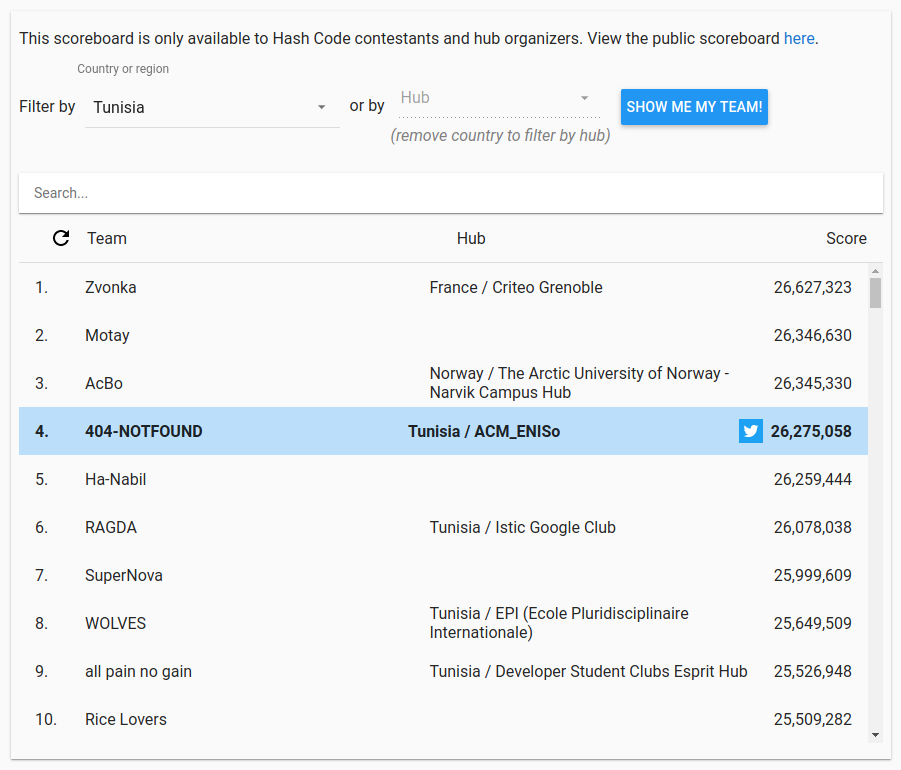

## Google Hashcode 2020 - Team 404-NOTFOUND Submission

This repository contains the source code of the team 404-NOTFOUND submission's in Google Hashcode 2020.
The team was composed of [Nasreddine Bac Ali][nasreddine-linkedin-profile] and [Nesrine Sghaier][nesrine-linkedin-profile],
tired from a long workday but with a lot of enthusiasm, they got a total score of `26,275,058` what gives them the `4th`
place in Tunisia and the `1132nd` in all the world.

The solution is written in `Java` programming language. The solution can read all the input files at once, run the algorithm
then generate the answers files and compress the solution files to be submitted in the [Google Hashcode Judging System]
[google-judging-system].

[nasreddine-linkedin-profile]: https://www.linkedin.com/in/bacali/
[nesrine-linkedin-profile]: https://www.linkedin.com/in/sghaiernesrine/
[google-judging-system]: https://hashcodejudge.withgoogle.com/